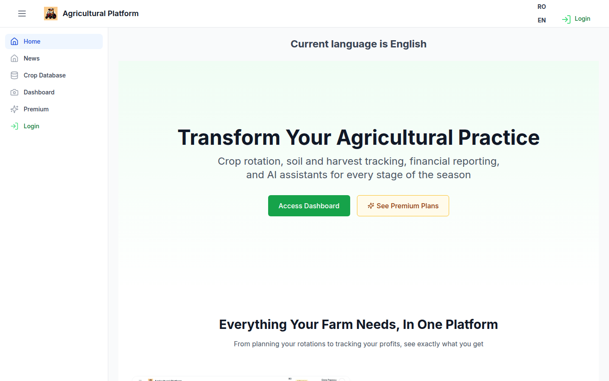
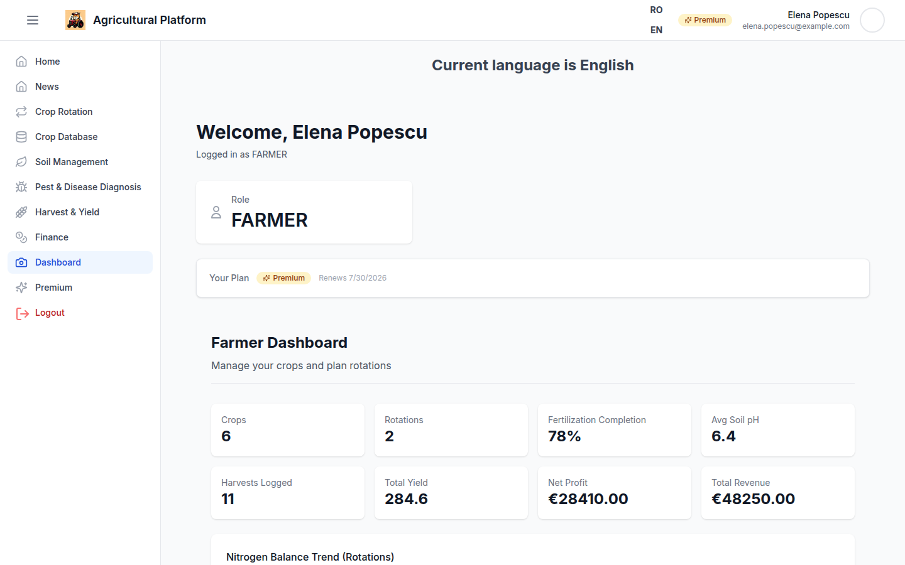
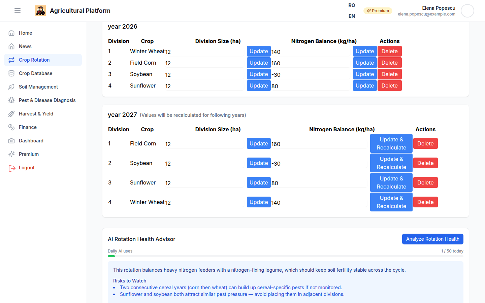
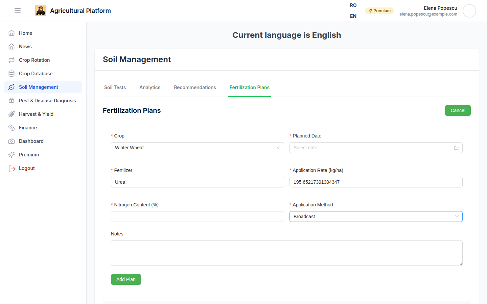
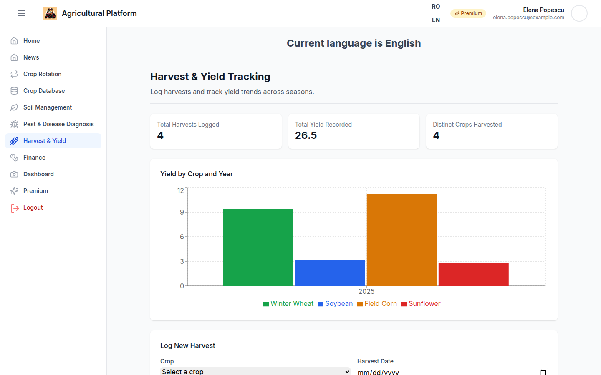
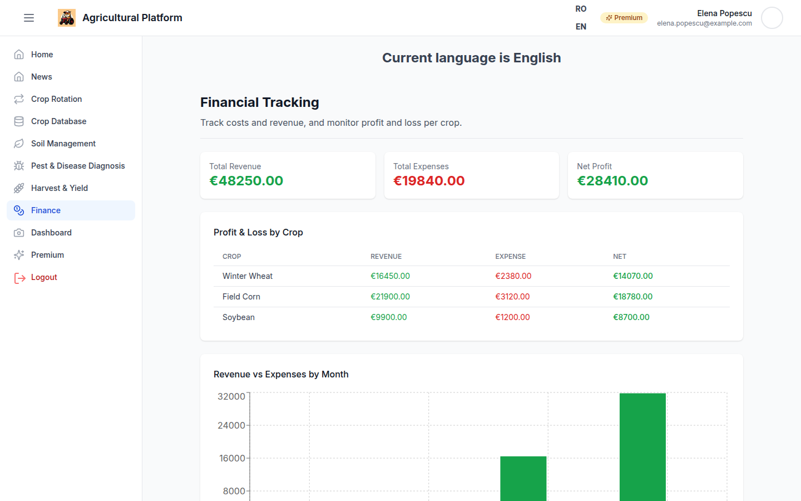
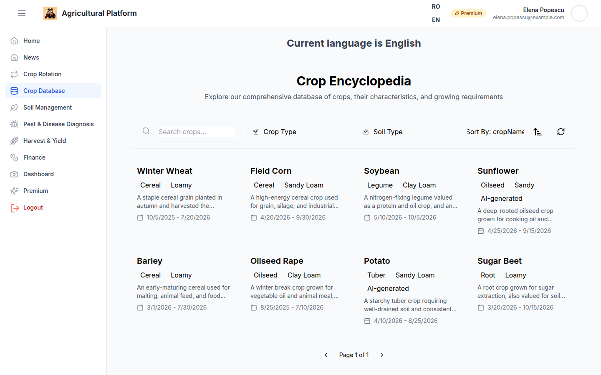
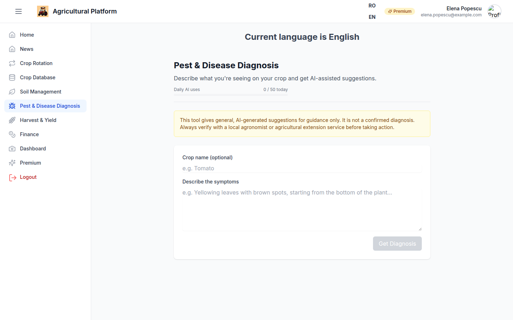
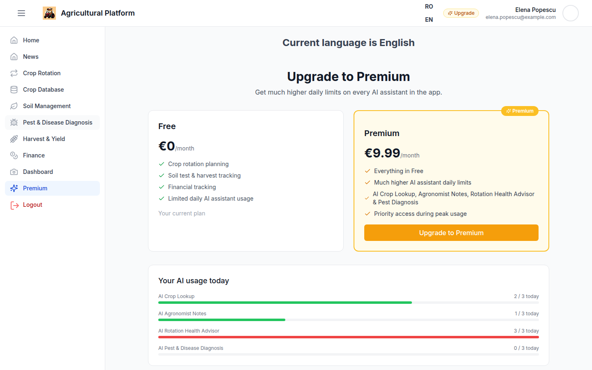

# Agricultural Management Platform

A full-stack Next.js application for managing every operational and financial aspect of a farm: crop rotation planning, soil and fertilization management, harvest and yield tracking, financial tracking, and a set of AI assistants that give farmers expert-level guidance without an agronomist on staff.



## What This App Does

Farmers juggle a lot: what to plant where, how to keep soil healthy across seasons, when to fertilize, what's eating their crops, how much they harvested, and whether they're actually making money. This platform brings all of that into one place, and layers AI on top of the parts that normally require expert knowledge — rotation health, fertilizer dosing, crop requirements, and pest/disease identification.

Accounts are split into **Free** and **Premium** tiers (billed via Stripe). Every AI feature works on both tiers; Premium simply raises the daily usage limit and unlocks priority access.

## Features

### 📊 Dashboard & Analytics
A live overview of the farm: active rotations, recent activity, and account/subscription status in one screen.



### 🌱 Crop Rotation Planning
Design multi-year rotation plans by field, automatically split into divisions, with nitrogen balance tracked across seasons. An **AI rotation health advisor** reviews the plan and flags risks (nitrogen deficits, repeated crop families, poor sequencing) before you plant.



### 🧪 Soil Management & Fertilization AI
Log soil tests (pH, organic matter, N-P-K, texture) per field, build fertilization plans, and generate **AI-backed fertilizer recommendations** — rate, timing, and application method tailored to the selected crop, field, and soil chemistry, plus free-text agronomist notes.



### 🌾 Harvest & Yield Tracking
Record harvests as they happen and track yield trends per crop and per field over time.



### 💰 Finance Tracking
Track income and expenses by category and see profit and loss at a glance for any period.



### 🔍 AI Crop Encyclopedia
Look up any crop's ideal soil, climate, and fertilizer requirements. If a crop isn't already in the database, the AI generates a profile for it on demand and the result is cached for future lookups.



### 🐛 Pest & Disease Diagnosis
Describe what you're seeing in the field (symptoms, affected crop, conditions) and get AI-assisted suggestions on the likely cause along with recommended next steps.



### ⚡ Premium Subscription
Free accounts get daily-limited access to every AI feature. Premium (€9.99/month via Stripe Checkout) raises those limits and unlocks priority access. Users can self-serve manage billing through the Stripe customer portal.



### Also included
- **Crop database & posts** — a community feed of crop-related posts
- **Weather integration** — current conditions and forecast pulled from OpenWeatherMap
- **Authentication & roles** — Auth0 login with Admin/Farmer role-based access
- **Internationalization** — full English and Romanian translations via `next-intl`
- **Agricultural news feed** — latest industry news on the homepage

## Tech Stack

| Layer | Technology |
|---|---|
| Framework | Next.js 14 (App Router) |
| Language | TypeScript |
| Database | Azure SQL Server via Prisma ORM |
| Authentication | Auth0 (`@auth0/nextjs-auth0`) |
| Payments | Stripe (Checkout + Billing Portal + webhooks) |
| AI | OpenAI (rotation insights, fertilization insights, crop lookup, pest diagnosis) |
| Weather | OpenWeatherMap API |
| Styling/UI | Tailwind CSS, antd, react-bootstrap, NextUI, Lucide icons |
| Charts | Recharts |
| State | React Context (`UserProvider`) |
| Testing | Vitest, Testing Library |

## Project Structure

```
app/
├── api/Controllers/      # API routes (Rotation, Soil, Harvest, Finance, Billing, Crop, Diagnosis, Weather, User, Post)
├── components/            # Shared UI components (layout, premium badges, cards, etc.)
├── providers/              # React Context providers (UserStore: auth + billing state)
├── lib/                    # Shared utilities (AI clients, rate limiting, Stripe plans)
├── Rotatie/                # Crop rotation planning feature
├── SoilManagement/         # Soil tests & fertilization feature
├── Harvest/                # Harvest & yield tracking feature
├── Finance/                # Financial tracking feature
├── CropWiki/                # AI crop encyclopedia
├── PestDiagnosis/           # AI pest & disease diagnosis
├── Premium/                  # Subscription plans & billing
├── dashboard/                 # Analytics dashboard
└── News/                       # Agricultural news feed

prisma/
└── schema.prisma            # Database schema (Prisma + Azure SQL Server)
```

## Getting Started

### Prerequisites
- Node.js 18+
- A SQL Server-compatible database (the app targets Azure SQL Server)
- An [Auth0](https://auth0.com/) application
- A [Stripe](https://stripe.com/) account (for the Premium subscription flow)
- An [OpenAI](https://platform.openai.com/) API key (for AI features)
- An [OpenWeatherMap](https://openweathermap.org/api) API key (for weather)

### Setup

1. Clone the repository and install dependencies:
   ```bash
   npm install
   ```

2. Create a `.env` file in the project root:
   ```env
   # Database
   DATABASE_URL=your_sql_server_connection_string

   # Auth0
   AUTH0_SECRET=your_auth0_secret
   AUTH0_BASE_URL=http://localhost:3000
   AUTH0_ISSUER_BASE_URL=your_auth0_issuer_url
   AUTH0_CLIENT_ID=your_auth0_client_id
   AUTH0_CLIENT_SECRET=your_auth0_client_secret

   # Admin
   ADMIN_EMAIL=your_admin_email

   # Stripe
   STRIPE_SECRET_KEY=your_stripe_secret_key
   STRIPE_PREMIUM_PRICE_ID=your_stripe_price_id
   STRIPE_WEBHOOK_SECRET=your_stripe_webhook_secret

   # OpenAI
   OPENAI_API_KEY=your_openai_api_key
   OPENAI_ROTATION_INSIGHT_MODEL=gpt-4o-mini
   OPENAI_FERTILIZATION_INSIGHT_MODEL=gpt-4o-mini
   OPENAI_CROP_LOOKUP_MODEL=gpt-4o-mini
   OPENAI_PEST_DIAGNOSIS_MODEL=gpt-4o-mini

   # Weather
   OPENWEATHERMAP_API_KEY=your_openweathermap_api_key
   ```

3. Push the Prisma schema to your database:
   ```bash
   npx prisma db push
   ```

4. Start the development server:
   ```bash
   npm run dev
   ```

   The app will be available at [http://localhost:3000](http://localhost:3000).

### Other Scripts

```bash
npm run build           # Production build (runs prisma generate first)
npm run start            # Start the production server
npm run lint               # Lint the codebase
npm run test                # Run the test suite (Vitest)
npm run test:watch           # Run tests in watch mode
npm run test:coverage         # Run tests with coverage
npm run seed                   # Seed the database
```

## License

This project is private and not licensed for redistribution.
